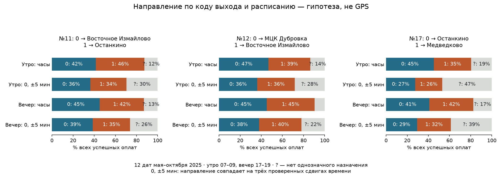

# Найден код выхода в trip_id: направление и сопоставление туда/обратно

Найден сильный структурный лид: последний компонент GTFS `trip_id` соответствует
кандидату на номер выхода `bus_exit_no`. Это позволяет получить конкретное
направление по расписанию, а не назначать его по предположению «утром в центр».
Историческое фактическое движение остаётся неподтверждённым: результаты ниже —
проверяемые гипотезы расписания, не географическая точность.

Продолжение: [парная проверка выбранного и противоположного направлений](../2026-09-27-direction-paired/README.md)
с одинаковой свободой по времени. Небольшое преимущество полной подгонки не
сохраняется на проверочном продолжении; большой выигрыш со штрафами вызван отказами.

## Что зашифровано в ID

Пример публичного ID расписания: `210_3159499_10_219`.
Первые два компонента точно равны `route_id` и `service_id`; третий ведёт себя
как номер рейса, четвёртый — как выход. Проверены все 1798 рейсов 11/12/17:

- 126 групп route/service/fourth-component,1672 соседних рейса без пересечений времени;
- 1663 из 1672 пар меняют направление,1664 увеличивают третий компонент на 1;
-контрольная группировка по третьему компоненту даёт только 125 из 1695 пар без пересечений;
-`block_id` пуст во всех 1798 рейсах. Семантика суффикса выведена из данных,
  а не объявлена источником. Правило специфично для этого feed.

Стандарт [GTFS](https://gtfs.org/documentation/schedule/reference/#tripstxt)
описывает block как последовательные рейсы одного транспорта, но не задаёт такой
формат trip_id. [Chen & Fan,2018](https://d-nb.info/1164363093/34) исследуют
восстановление направлений из AFC и временных разрывов; произвольная начальная
ориентация в таком подходе не доказывает географию. Здесь найден дополнительный
ключ выхода, которого не использовали предыдущие эксперименты.

## Проверка на реальных оплатах

Взяты 12 заранее зафиксированных дат мая–октября 2025: по вторнику и субботе каждого
месяца. Все успешные оплаты маршрутов 11/12/17 на этих датах: **1198451**.
Хешированные exit_key сопоставлены с кандидатами суффикса тем же namespace и
хешем архива, что использует исходный ledger; карточные/водительские ID не нужны.
Перед чтением проверены SHA256 каждого date-shard и связь его manifest с аудитом.

| Маршрут | Успешных оплат | Выход есть в активном календаре | Один рейс по выходу и часам | То же с намеренно чужим выходом | Согласие при 0/±5 мин |
|---|---:|---:|---:|---:|---:|
|11|330543|323001|284853(86,18%)|225939(68,35%)|239261(72,38%)|
|12|335576|330875|293690(87,52%)|241695(72,02%)|248573(74,07%)|
|17|532332|500840|442341(83,09%)|339164(63,71%)|321743(60,44%)|

Проценты считаются от всех успешных оплат соответствующего маршрута, включая
неизвестные выходы. Интервалы рейсов включают обе границы; неоднозначных
пересечений в этом прогоне 0. Учтены рейсы предыдущих служебных суток и время>24:00.
Контроль использует следующий по сортировке выход того же маршрута/даты, а не
выход другого маршрута. Это один детерминированный контроль, не permutation p-value.

Согласие на 0/±5 мин означает одинаковое направление на трёх проверенных сдвигах,
не на каждом возможном сдвиге внутри диапазона. На 0/±5/±15 мин остаются 159593,
178510 и 66140 событий соответственно. Особенно чувствителен короткий маршрут 17.

Эта таблица — описательное покрытие по ключу и часам. Она включает конфликты
идентичности и даты ограничений движения; это **не покрытие достоверных меток**.
Ограничения движения и конфликтные группы отдельно исключены из коротких окон ниже.

## Утро против вечера



| Маршрут, направление 0 | Доля направления 0 утром 07–09 | Вечером 17–19 |
|---|---:|---:|
|11 → Восточное Измайлово|47,49%|51,91%|
|12 → МЦК Дубровка|54,21%|49,98%|
|17 → Останкино|56,04%|49,42%|

В этой таблице знаменатель — только события с однозначным рейсом; на графике
знаменатель — все успешные оплаты, неизвестные показаны отдельно. Грубого правила
«все утром туда, вечером обратно» нет. На подмножестве со стабильностью 0/±5 мин
утренние доли направления 0 становятся 51,51%,50,31%,51,68%: асимметрия слаба и
чувствительна к расписанию. Смешение будней/выходных, месяцев, фактического сервиса
и пропусков не позволяет трактовать эти доли как измеренный маятниковый спрос.

## Сопоставление остановок в обоих направлениях

Из 288 запланированных часов по двум наиболее активным подходящим группам вагонов
каждого маршрута/даты осталось 39 коротких последовательностей,25 из них в июле–октябре.
235 часов не дали 8 компактных adaptive-начал,8 исключены по сообщениям об изменениях
движения,4 не имеют выхода в активном расписании,2 имеют<20 оплат.
Выборка сильно смещена к плотным будничным посадкам; она не представляет все рейсы.

Для каждого окна оба направления подбираются раздельно: первые 4 начала выбирают
рейс/начальную остановку/offset, следующие 4 проверяют продолжение без смены профиля.
Выход ограничивает кандидатов; проверены terminal prior0/60/180 с. Первая оплата
не объявляется конечной. Повторные имена остановок сохраняются с разными stop_id.

В [examples.json](examples.json) — первый пример в порядке дата/ранг группы/час
с устойчивостью к prior и существующим продолжением для каждой пары маршрут/утро-вечер, без отбора
по самой маленькой ошибке. Например:

- 11,13 мая,08 ч: в сторону **Останкина**; Восточное Измайлово →15-я Парковая →
  13-я Парковая → Первомайская, затем Галерея Измайлово → Ибрагимова → Семёновская.
  Средняя абсолютная ошибка четырёх последующих интервалов 29,5 с.
- 11,9 сентября,18 ч: в сторону **Восточного Измайлова**, Семёновская → Ибрагимова →
  Фортунатовская → Мост Окружной железной дороги; последующие интервалы 34,75 с.
- 12: утренний пример к **МЦК Дубровка**,27,25 с; вечерний в **Восточное Измайлово**,19,75 с.
- 17: утренний пример к **Останкину**,36,5 с; вечерний к **Медведкову** значительно хуже,
  253,75 с. Этот неудобный пример сохранён, а не заменён более красивым.

Это гипотезы разных дат/групп, не доказанная поездка одного пассажира туда-обратно.
Устойчивость prefix к priors не равна успешному продолжению или правильной остановке.

## Что показали отрицательные контроли

Для 25 окон июля–октября ошибка продолжения ограничена 900 с на интервал;
отказ/ничья получает 900 с и остаётся в знаменателе:

| Метод | Средняя capped loss,с |
|---|---:|
|Выход из события|210,34|
|Чужой выход|461,76|
|Любой выход|252,77|
|Перемешанные интервалы того же окна|206,71|
|Часы сдвинуты на 17 мин|151,54|

Правильный выход лучше выбранного чужого — полезная поддержка ID-связи. Но
перестановка интервалов не хуже, а сдвиг часов лучше. Поэтому точная остановочная
локализация **не прошла проверку**. Из 25 выбранных направлений 20 имеют продолжение;
ни у одного окна не продолжаются оба направления одновременно. Это ограничение
геометрии/длины рейса, а не независимая проверка истинного направления. В свободном
поиске среди всех выходов есть 19 парных продолжений, из них 16 с выбранным
победителем prefix; на этих 16 он также не лучше альтернативы. MAE интервалов —
согласованность с расписанием, не stop accuracy.

Детектор начал видит целое часовое окно, а выбор групп использует активность
утром и вечером. Фиксация prefix — условная offline-проверка продолжения;
она не доказывает отсутствие утечки при прогнозе в реальном времени.

## Источники, границы и воспроизведение

GTFS взят из [предыдущего аудита](../2026-09-26-absolute-clock/README.md):
захват 30.06.2026, встроенные даты 27.05.2025, календари апреля–мая 2025.
`historical_operation_confirmed=False` сохраняется. Календарь не доказывает
выполнение рейса в выбранный день; полного исторического журнала изменений нет.
Июль–октябрь — отложенный срез этого эксперимента, но уже изучался ранее в проекте,
поэтому не называется независимым слепым тестом. Явные сырые ID и оплаты в Git не
добавлены; результат не подключён к прогнозу или serving.

Из выделенного worktree, с зависимостями существующего lock-файла:

```sh
PYTHONPATH=ml/src .venv/bin/python scripts/audit_direction_evidence.py \
 --partitions ../boarding-real-alignment/ml/artifacts/boarding-date-shards \
 --audit-manifest ../boarding-dataset/ml/artifacts/boarding-2025-reviewed/manifest.json \
 --feed ../boarding-absolute-clock/ml/artifacts/clock-sources/gtfs.json \
 --service-policy docs/analysis/2026-09-26-real-stops/service-notices.json \
 --source-root ../boarding-real-alignment \
 --out ml/artifacts/direction-evidence-new --workers 4
PYTHONPATH=ml/src .venv/bin/python scripts/report_direction_evidence.py \
 --run ml/artifacts/direction-evidence-new --out /tmp/direction-report-new
.venv/bin/pytest -q ml/tests/test_boarding_direction_probe.py
make check
```

Готовые каталоги не перезаписываются. [manifest.json](manifest.json) связывает
источники/код/полные результаты; [report-manifest.json](report-manifest.json)
фиксирует опубликованные агрегаты/примеры/график. Полные 39 результатов лежат в
ignored `ml/artifacts/direction-evidence-v2/rows.json`. V1 заменён V2 после исправления
знаменателя неизвестных выходов и явного учёта отказов в loss.

Проверки:10 focused tests passed; личный parent `make check` exit 0:
350 backend + 929 ML + 92 frontend + 119 contracts = 1490 passed, 48 SQL skipped.
Ruff, mypy, architecture, golden, OpenAPI, build, Compose passed. Три повторных
однопроцессных fit побитно совпали по JSON-значениям с 4 процессами; выходные SHA256
проверены. Независимый read-only review исправил знаменатели и трактовку устойчивости.
Новых зависимостей нет; frontend npm ci использовал прежний lock, audit 0 уязвимостей.

База d6dc3a46c2bdfcb70cb9b5b40ef0a382feed035a; worktree
`/Users/cute/MosTransport2026Hack-worktrees/direction-evidence-20260927`, ветка
`agent/direction-evidence-20260927`. Следующий обоснованный эксперимент — оценивать
общий сдвиг часов выхода по ранним рейсам и проверять последующие целиком,
сравнивая с чужими выходами; не подгонять независимый offset к каждой остановке.

Во время работы main обновилась до24cc28f; сохранены обе истории обычным merge
в исследовательской ветке. Единственный конфликт трекера разрешён сохранением
чужой TASK-077 и переименованием этого исследования в TASK-078. Объединённое
дерево повторно прошло parent make check. Интеграция в primary — fast-forward;
исходные неотслеживаемые ZIP/OS-файлы сохранены. Worktree остаётся для локальных
артефактов и неопубликованной ветки; push в рамках этой задачи не выполнялся.

При синхронизации 2026-09-27 локальные TASK-078/079 перенумерованы в TASK-080/081; опубликованные TASK-078/079 относятся к маршрутному ML и обзору моделей.
