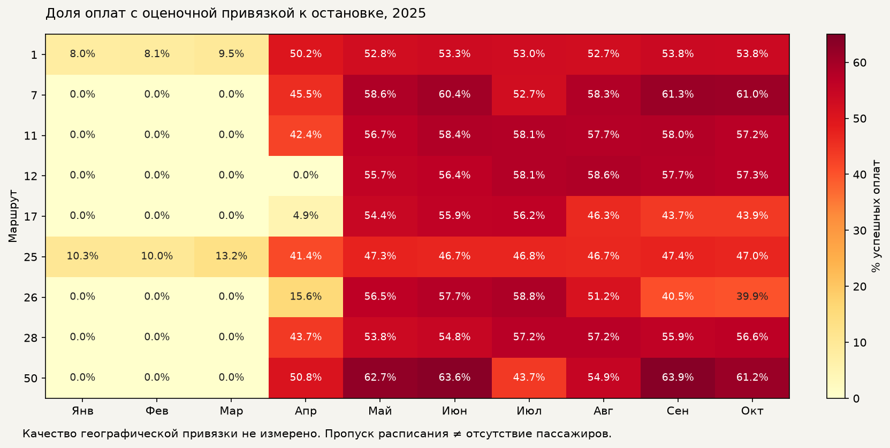

# Full datasets, new duty mapping and forecast comparison

The competition target is successful validations per route/date/hour. January–October
labels are observed; November–December labels are hidden. Stop targets in this work
are inferred scheduled-arrival candidates, not observed boarding locations, unique
people or onboard occupancy. Every unidentified event remains explicit route mass.

## Source and synchronization

Primary base `bdcb2f81d3689524e86a8e8a511effe1eec2a4bb`. All origin refs fetched;
latest origin/main `448b883` merged in isolated integration worktree at `3dc1877`.
Only tracker numbering conflicted: remote weather/pitch records became086/087,
preserving the locally existing direction records. No source/runtime merge conflict.
The user asked for pull/merge; no remote push or competition upload is part of this run.

Worktrees retained for private artifacts and review:

|Role|Branch|Path|
|---|---|---|
|Integration/features|agent/full-features-20260927|/Users/cute/MosTransport2026Hack-worktrees/full-features-20260927|
|Statistical experiments|agent/stat-sweep-20260927|/Users/cute/MosTransport2026Hack-worktrees/stat-sweep-20260927|
|Full mapper|agent/duty-mapping-full-20260927|/Users/cute/MosTransport2026Hack-worktrees/duty-mapping-full-20260927|
|Stop regressors/EDA|agent/stop-models-20260927|/Users/cute/MosTransport2026Hack-worktrees/stop-models-20260927|

Independent branches use shared base3dc1877. Lead owns integration and final gate.
Large outputs stay ignored; no raw cards, transaction IDs or validator IDs are exported.
No dependency added; bootstrap reproduced the existing locked environment.

## New mapping and complete targets

The old HMM-derived full export was explicitly rejected by the user. The replacement
uses the latest audited duty relationship: route + `bus_exit_no` + service date and
clock -> unique GTFS trip -> scheduled direction. The unsuccessful fitted clock
correction is excluded. A new, explicitly approximate stop rule requires a unique
closest scheduled arrival within90seconds and stable stop identity under +/-15seconds.
The latter is positional stability, not measured correctness or clock-error coverage.

All304days and59,667,191successful events were rebuilt.32,141,999have a unique trip;
21,060,982have a retained stop candidate and38,606,209remain unallocated. Source
coverage changes from about1%stop assignments in January–March to53–57%fromMay;
this is a mapping observability transition, not observed demand growth.
The finalizer checks every route-hour sum; no mass is normalized onto known stops.



The heatmap denominator is all successful events for each route/month; its CSV
and source checksum are stored beside this report. A zero cell is unavailable
assignment, not evidence of zero stop demand.

See [mapping method, counts, controls and reproduction](../2026-09-27-full-duty-mapping/README.md).
The immutable dataset is at the mapper worktree's
`ml/artifacts/full-duty-mapping-v1`. It contains daily receipts, trip aggregates,
coverage tables, three split files, source/code hashes, and GTFS stop catalog.
Namespaces `gtfs:<id>` and `unallocated:<route>` must never be equated with OSM IDs.
The later-captured feed and coordinates are retrospective sources; service-notice
exclusions and independent GPS validation are not available in this version.

## Feature datasets

Integration output root:
`/Users/cute/MosTransport2026Hack-worktrees/full-features-20260927/ml/artifacts/full-features-v2`.
Accepted subdirectories `routes`, `stops-final`, and `stop-matrices` have completion
manifests, schemas/row counts and SHA-256. The earlier `stops` export is superseded
by `stops-final`, regenerated against the final feature implementation hash.

|Dataset|Rows|Meaning|
|---|---:|---|
|routes/route-hour-labels.csv.gz|72,960|Complete10routes×304days×24hours; reconciled observed target|
|routes/route-hour-calendar.csv.gz|72,960|Target plus known calendar/cyclic time features|
|routes/evaluation-*.csv.gz|6×14,640|Complete61day windows; target attached only after predictors|
|routes/training-direct-61-day.csv.gz|204,960|Historical direct-horizon examples with origin/cutoff per row|
|routes/submission-features.csv.gz|14,640|November–December predictors, no future target|
|stops-final/stop-features-train.csv.gz|733,318|New January–June mapped/unknown targets and metadata|
|stops-final/stop-features-development.csv.gz|534,474|New July–August mapped/unknown targets and metadata|
|stops-final/stop-features-diagnostic.csv.gz|528,560|New September–October mapped/unknown targets and metadata|
|stop-matrices/training-*.csv.gz|6,545,472|Every eligible stop-origin-hour example; no sampling in export|
|stop-matrices/forecast-304.csv.gz|854,976|584identities×61days×24hours, no target column|

Stop matrices use574declared route/direction/stop identities plus10unallocated
buckets. Their universe comes from the declared static catalog, not future label
support. Static catalog historical availability is still unverified. Separate
`target_date`, `origin`, `feature_cutoff`, `stop_id`, and `expected_count_target`
prevent accidentally treating target values as predictors. The complete export
precedes model sampling; CatBoost fits use at most60,000examples per monthly origin.

Predictors include hour, weekday, official day type/holiday, month, forecast lead,
coordinates with missing flags,28/56/84-day stop profiles, pre-origin route profile,
observed-support and unallocated indicators. Calendar exports additionally contain
cyclical hour/weekday/year coordinates. Calendar day and hour useEurope/Moscow.
Every historical profile stops strictly before origin. Changing future values cannot
change forecast features. Catalog ambiguity does not duplicate rows or erase flags.

The repository's complete actual2025weather is preserved from origin/main, but
actual forecast-period weather is excluded from cutoff-safe predictors. The OSM
weather-stop catalog is a different namespace; a GTFS/OSM join is not invented.

## Statistical comparison and EDA

[All statistical configurations, rankings and slices](../2026-09-27-statistical-sweep/README.md)
cover three declared phases:114+13+125configurations and684+78+750=1,512evaluations.
Repeated references/overlapping configurations are included; these are not252
independent algorithm families. Methods cover calendar-month/window means, medians,
trimmed means, quantiles, exponential month/day weights, calendar mixtures,
level corrections, daily/hour decomposition, SES and damped Holt.

|61day origin|Existing calendar_weekday_blend|Best monthly-mean development selection|
|---|---:|---:|
|April1|0.857396|0.848011|
|May1|0.863650|0.879588|
|June1|0.798424|0.814735|
|July1|0.821191|0.816573|
|August1|0.880037|0.877818|
|September1|0.885933|0.880647|

Best single statistical result0.891994is the September seasonal median, selected
retrospectively from the comparison. Stable0.88and0.93were not achieved.
The robust monthly mean loses to the existing baseline on four of six windows;
it is not promoted automatically. September has already informed earlier research.
Windows overlap; no independence or untouched-holdout claim is made.

[EDA with measured route/hour/month errors](../2026-09-27-stop-models/statistical-eda.md)
shows route7contributes24.5%of July error and route50another15.7%, with opposite
biases. The late-summer recovery is visible retrospectively; it cannot be injected
into a July-origin forecast unless known before that origin. Target-month oracle
means in that report are diagnostic only and excluded from forecast rankings.

## Stop modeling and map

[Stop-model comparison](../2026-09-27-stop-models/README.md) predicts each inferred
stop-hour independently, including the unknown bucket, and sums continuous values
before organizer rounding. No route total is imposed to manufacture an improvement.
Scores against pseudo-labels are separate from scores against actual route labels.
The source coverage transition is a major limitation of this training target.
The initial support-derived identity experiment was superseded after review;
only the catalog-defined rerun is accepted evidence.

Final predictions are at the stop-model worktree’s
`ml/artifacts/new-duty-stop-models-v3/stop_predictions.csv.gz` (854,976 rows) and
`submission.csv` (14,640 rows). Selected calendar blend scores on May / July /
September origins are **0.863650 / 0.821191 / 0.885933**. Unknown future mass is
**72.21%**; this remains a material limitation, not a completed spatial forecast.

The offline map `ml/artifacts/full-features-v2/demand-map.html` uses forecast values, filters by month/route/hour/direction, retains
unknown demand, and provides an accessible numerical table plus CSV export. It shows
boarding demand, not people simultaneously onboard; uncertainty intervals remain
explicitly unavailable. It contains no remote basemap or hidden network dependency.

## Verification and reproducibility

`complete_features` validates source hashes, original Moscow hour, join cardinality,
finite coordinates, target mass and exact evaluation keys. Stop model tests cover
future-value/identity perturbations and aggregate conservation. Mapping tests cover
calendar/midnight, overlaps, ties and unknown mass. Statistical tests cover every
configuration's fixed-series and future-label behavior.

Commands are executed with the integration `.venv` created by `make bootstrap`:

```sh
python -m tramflow_ml.complete_features routes --archive '/Users/cute/MosTransport2026Hack/dataset (1).zip' \
 --reconciliation /tmp/tram-eda/results/reconciliation.json --out /path/to/new-route-export
python -m tramflow_ml.complete_features stops --source /path/to/full-duty-mapping-v1 \
 --out /path/to/new-stop-export
```

For complete unsampled stop matrices, call `stop_models.load_dataset(source,archive,proof)`
then `complete_features.export_stop_model_features(data,new_output_directory)`.
Feature-matrix source hash binds the corrected810139emodel checkpoint; later added
calendar baselines do not change `features()` or exported values. Preserve the source
hashes rather than claiming code reruns against an arbitrary newer implementation.

Browser verification confirmed November mean 196,916.75 boardings/day and
142,501.34 unknown; December 206,094.71 and 148,528.04 respectively. Route 5 is
zero, all four filters update the table/map, and the CSV action executes.
Independent review verified these sums directly from all forecast rows.

### Historical schedule recovery: incomplete

January–March contains 18,220,771 events; only 195,092 receive a stop candidate
(1.0707%). The feed has 18 service calendars for 9 active scored routes. All
weekday calendars begin in April–May; only route 1 and 25 weekend calendars cover
the first quarter. Extending those dates backwards would invent service validity.

The [MobilityDatabase source](https://mobilitydatabase.org/feeds/gtfs/mdb-3226)
lists one June 2026 snapshot. Historical upstream versions were not available.
Official dated schedule requests failed with SSL/connect timeouts through both
HTTP client and browser. Public archive recovery is recorded in the schedule
preflight report; recovered HTML without trip/stop clocks is not accepted data.
The missing historical schedules block a trustworthy January–March rerun.

[GTFS preflight](../2026-09-27-historical-schedule-preflight/README.md) reads
calendars, trips and stop times before payment processing. The supplied snapshot
has 850 missing route-days among 2,736 checked and 177,845 global orphan stop-time
rows. The latter cannot be assigned reliably to a route. These defects are
reported explicitly, not repaired through fabricated timetable rows.

[Public archive receipts](../2026-09-27-historical-schedules-web/README.md) include
the actual February 11 CommonCrawl retrieval with an empty timetable area.

### Final lead verification and integration

Verified implementation merge: `a0c2fdb68a2463af815c7ee48bf77f4acd3559c1`.
Subsequent completion-receipt edits affect documentation only.

`PATH=/tmp/tramflow-tools/bin:/tmp/tramflow-node/node_modules/.bin:$PATH make check`
completed with **exit 0** in the integration worktree:

- ML: **1,329 passed**; backend: **350 passed, 48 skipped**.
- Frontend: **92 tests / 15 files passed**, typecheck and production build passed.
- Shared contracts: **119 passed**; Ruff, mypy, architecture boundaries and
  `docker compose config --quiet` passed. The skipped backend integration tests
  are not represented as executed database tests.
- Lead verified hashes of all **24** exported dataset/catalog files.
- Schedule preflight: **13 tests**, independent review, and real archive run
  with expected **exit 2** for the measured gaps/orphans.
- Diff audit passed with `git -c core.whitespace=cr-at-eol diff bdcb2f8 --check`;
  the checksum-bound schedule CSV uses standard CSV CRLF line endings.

Integration uses `git merge --ff-only agent/full-features-20260927` on primary
`main`, preserving the original untracked archive and Finder metadata. No push.
Worktrees and separate statistical branch remain retained: private datasets and
model artifacts live there, and branches have not been pushed. No cleanup or
force deletion was performed. TASK-088 stays blocked specifically on the
requested trustworthy Q1 historical-schedule recovery; completed code and
experimental results are available independently of that missing source.
