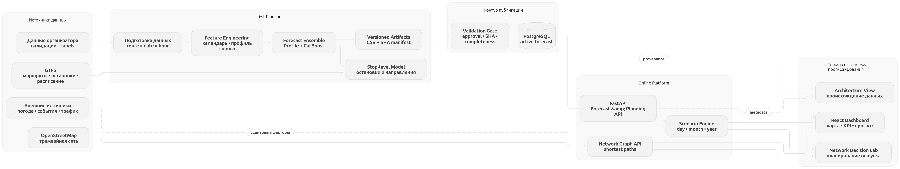


# Фактическая архитектура Тормоза

[Требования организатора](../product/TASK.md) · [контракт датасета](../product/DATASET.md) · [воспроизведение конкурсного CSV](../../ml/competition_submissions/2026-09-27/README.md)

Интерактивная схема для жюри: [«Как работает Тормоза»](http://localhost:8080/?view=architecture); её фактические узлы описаны в [`architecture-data.ts`](../../frontend/src/features/architecture/architecture-data.ts). Шесть связанных узлов показывают основной путь; оценочные и экспериментальные сценарии раскрываются отдельно. Оба представления обновляются вместе при изменении потоков.

## Схемы в полном разрешении

Обе схемы широкие: встроенный просмотр в GitHub уменьшает подписи. Нажмите на
изображение или ссылку «Открыть PNG», затем увеличьте его в браузере.

**Обзорная схема** — источники, конкурсный ML-контур, публикация и сервис.
[Открыть PNG 5866 × 1108](assets/tormoza-overview.png?raw=1).

[](assets/tormoza-overview.png?raw=1)

**Подробная схема** — компоненты обучения, артефакты, API и интерфейс.
[Открыть PNG 12419 × 1596](assets/tormoza-detailed.png?raw=1).

<details>
<summary>Показать предпросмотр подробной схемы</summary>

[](assets/tormoza-detailed.png?raw=1)

</details>

Схемы показывают функциональные связи. Точные границы ниже: конкурсный CSV и
опубликованный GET не зависят от OSM-графа или оценок остановок; планирование
выпуска берёт прогноз из planning API и расписание из отдельного GTFS-артефакта,
а граф сети обслуживает самостоятельный сценарий.

Целевая величина конкурса — число **успешных валидаций на маршруте в календарный час**, а не наполненность вагона. Опубликованный маршрутный ряд охватывает 10 маршрутов и 61 день ноября–декабря 2025 (14 640 точек). Данные отдельной посадки не содержат наблюдаемую остановку или направление; GTFS задаёт справочные остановки и рейсы, а пространственная привязка остаётся оценкой.

## Работающий путь данных

```text
Организатор: dataset.zip (train.csv, test.csv, labels, GTFS-справочники)
  ├─ наблюдаемые успешные валидации + сверка с labels ───────────────────────┐
  │  ml/.../competition_reconcile.py, competition.py                         │
  │  → маршрут × дата × час, Europe/Moscow, предел 2025-10-31         │
  │                                                                          ▼
  │  competition_profile.py + competition_hybrid.py + competition_cli.py
  │  → хронологическая проверка → 14 640 прогнозов в CSV и SHA-манифест
  │  ml/competition_submissions/current.json + approved.json
  │  → scored_bundle.py → forecast_publication.py → PostgreSQL
  │  → GET /api/v1/forecasts (day/hour, month/day) → график и CSV
  │
  └─ GTFS-остановки/рейсы + оценочные остановочные labels
     → scripts/build_planning_artifact.py, data/planning/*
     → POST /api/v1/planning/forecast (day/month/year)
     → карта, график, сценарные веса и CSV

Отдельно: архивные погодные прогнозы + официальный календарь + сообщения
         Дептранса до origin → ml/src/tramflow_ml/approved_external.py
         → data/planning/approved-source-variants.json.gz (SHA bound)
         → POST approved при source_enabled или весах факторов; без выбора — исходный ряд.
         external_experiment читает свой прежний артефакт отдельно.

Отдельно: OSM → scripts/fetch_tram_graph.py → data/tram_graph.json + data/tram_graph.geojson
         → /api/v1/tram-graph/* → вкладка «Граф сети».

Отдельно: ретроспективный GTFS → scripts/build_network_service_estimates.py
         → frontend/src/features/decision-lab/service-estimates.json
         + POST с `approved` → вкладка «Планирование сети».
```

Стрелка от GTFS к конкурсному маршруту **отсутствует**: обучение, пакетное прогнозирование, конкурсный CSV и опубликованный GET не зависят от оценочных остановок, направлений, графа OSM или дополнительных источников. Основная модель использует производственный календарь. Дополнительные обученные ветки меняют только явно запрошенный `approved` POST; их CSV не опубликован на лидерборде. Сверка сырых успешных событий с положительными организаторскими метками описана в [DATASET.md](../product/DATASET.md); отсутствие ключа трактуется как нуль только после этой сверки и только в предоставленных файлах. Сырой архив и идентификаторы пассажиров остаются вне Git и веб-сервиса.

| Граница и вход | Реальный модуль и выход | Происхождение и ограничение |
|---|---|---|
| Приём и сверка сырых данных с метками | [`ml/src/tramflow_ml/competition_reconcile.py`](../../ml/src/tramflow_ml/competition_reconcile.py), [`competition.py`](../../ml/src/tramflow_ml/competition.py) → подтверждённые маршрутно-часовые агрегаты | Организаторские `train.csv`, `test.csv`, `labels/`; период для признаков заканчивается 2025-10-31. [`intake/`](../../ml/src/tramflow_ml/intake/) и [`ingestion/`](../../ml/src/tramflow_ml/ingestion/) содержат проверяемые адаптеры приёма; они не означают, что телеметрия вошла в конкурсный прогноз. |
| Признаки, обучение, пакетное прогнозирование | [`competition_profile.py`](../../ml/src/tramflow_ml/competition_profile.py), [`competition_hybrid.py`](../../ml/src/tramflow_ml/competition_hybrid.py), [`competition_cli.py`](../../ml/src/tramflow_ml/competition_cli.py) → CSV `route;date;hour;prediction` | Маршрутно-часовая история и календарь, хронологические окна. Конкурсные файлы, код воспроизведения и SHA — в [`ml/competition_submissions/2026-09-27/`](../../ml/competition_submissions/2026-09-27/). |
| Оценочная пространственная ветка | [`ml/src/tramflow_ml/boarding/`](../../ml/src/tramflow_ml/boarding/), [`stop_models.py`](../../ml/src/tramflow_ml/stop_models.py), [`scripts/build_planning_artifact.py`](../../scripts/build_planning_artifact.py) → проверяемые [`data/planning/`](../../data/planning/) артефакты | Справочники GTFS и расчётная привязка валидаций. Ни `stop_id`, ни `direction_id` GTFS не являются наблюдённой посадкой конкретной валидации. Нераспределённая масса сохраняется отдельно. |
| Проверка и публикация версии | [`backend/app/infrastructure/scored_bundle.py`](../../backend/app/infrastructure/scored_bundle.py), [`forecast_publication.py`](../../backend/app/infrastructure/forecast_publication.py) → опубликованные `forecast_runs`, `forecast_points`, `forecast_active_runs` | Проверяются approval, SHA и полнота конкурсной сетки; транзакция PostgreSQL меняет активные day/month версии вместе. Миграции — [`backend/alembic/`](../../backend/alembic/). |
| Online опубликованного ряда | [`api/routes/forecast.py`](../../backend/app/api/routes/forecast.py) → [`application/services/forecast.py`](../../backend/app/application/services/forecast.py) → [`infrastructure/repositories/forecast.py`](../../backend/app/infrastructure/repositories/forecast.py) → PostgreSQL | `GET /api/v1/forecasts` публикует day/month; часы дня и дни месяца. Маршрут, остановка/направление и полуоткрытый интервал `[start,end)` — HTTP-фильтры. Годовой ряд в этой публикации отсутствует. |
| Online планирования | [`api/routes/planning.py`](../../backend/app/api/routes/planning.py) → [`application/services/planning.py`](../../backend/app/application/services/planning.py), [`stop_planning.py`](../../backend/app/application/services/stop_planning.py) → [`infrastructure/planning.py`](../../backend/app/infrastructure/planning.py) | `POST /api/v1/planning/forecast`: `approved` (по умолчанию), оценочный `stop_model` или API-only `external_experiment`. `approved` без источников сохраняет конкурсный ряд; только `source_enabled` использует фиксированные доли по 0,05, а заданные веса факторов имеют приоритет и смешивают обученные ветки по нормированной сумме с основой веса 1. Двойного смешивания нет. `stop_model` и `external_experiment` для ручных весов сохраняют прежний отдельный артефакт. `year` — качественный сценарий с явными `qualitative`/`basis`. |
| HTTP → интерфейс | [`frontend/src/api/`](../../frontend/src/api/) → [`features/forecast/`](../../frontend/src/features/forecast/), [`features/planning/`](../../frontend/src/features/planning/) → [`App.tsx`](../../frontend/src/App.tsx) | Главная показывает карту, график, CSV и происхождение конкурсного снимка. Подробный GET опубликованного ряда с интервалами неопределённости и актуальностью БД остаётся по `?view=published` из раскрываемого блока главной, без отдельного пункта навигации. Режим всей сети запрашивает десять отдельных day POST через [`use-network-planning.ts`](../../frontend/src/features/planning/use-network-planning.ts) и схему OSM через [`use-tram-network.ts`](../../frontend/src/features/tram-network/hooks/use-tram-network.ts); GTFS-оценки не соединяются с идентификаторами OSM. |

## Путь одного запроса

- **Опубликованный ряд.** Выбор маршрута, day/month и необязательного интервала в [`App.tsx`](../../frontend/src/App.tsx) идёт через [`use-forecast.ts`](../../frontend/src/features/forecast/hooks/use-forecast.ts) и [`api/client.ts`](../../frontend/src/api/client.ts) в `GET /api/v1/forecasts`. Сервис читает активную версию из PostgreSQL, отдаёт точки и происхождение; [`forecast-chart.tsx`](../../frontend/src/features/forecast/components/forecast-chart.tsx) и [`forecast-export.tsx`](../../frontend/src/features/forecast/components/forecast-export.tsx) используют тот же ответ. Опубликованные конкурсные точки не имеют наблюдённых остановок.
- **Оценочный сценарий.** Выбор маршрута, горизонта, GTFS-остановки/оценочного направления и весов в [`planning-view.tsx`](../../frontend/src/features/planning/planning-view.tsx) идёт через [`use-planning.ts`](../../frontend/src/features/planning/use-planning.ts) и [`api/planning.ts`](../../frontend/src/api/planning.ts) в `POST /api/v1/planning/forecast`. Главная передаёт только явно включённые пользователем `factors`; `source_enabled` остаётся выключенным. Для утверждённой основы используются новые checksum-bound ветки, для остановочной — прежние экспериментальные. Один ответ питает карту, график и CSV с тем же пресетом. Год — продление профиля за конкурсный период с маркировкой сценарных точек.
- **Вся сеть на карте.** [`use-network-planning.ts`](../../frontend/src/features/planning/use-network-planning.ts) посылает десять независимых `stop_model`/выбранного режима day POST на одну дату. Неполные ответы отмечаются, общий CSV доступен только при всех десяти ответах. [`use-tram-network.ts`](../../frontend/src/features/tram-network/hooks/use-tram-network.ts) отдельно читает OSM GeoJSON для линий и полного каталога остановок; цветные прогнозные точки остаются GTFS-оценками маршрутов, без соединения идентификаторов OSM и GTFS.
- **Планирование выпуска.** [`features/decision-lab/`](../../frontend/src/features/decision-lab/) запрашивает `approved` day через тот же planning POST для десяти маршрутов. Локальный [артефакт расписания](../../frontend/src/features/decision-lab/service-estimates.json) даёт плановые отправления и оценку полного оборота по девяти маршрутам; №5 не имеет профиля. Окно выбирается от 1 до 24 часов. Рейтинг сравнивает посадки на плановое отправление при достаточном покрытии окна, а сценарий позволяет исправить интервал и оборот вручную. Артефакт воспроизводится [скриптом](../../scripts/build_network_service_estimates.py) из GTFS с фиксированным SHA. Снимок получен 30.06.2026, а `block_id` пуст: код выхода в `trip_id` служит только оценочной связкой рейсов. Общий спрос остаётся неизменным; это не наблюдение наполненности или фактического расписания. Ветка не изменяет конкурсный CSV и опубликованный ряд.

## Развёртывание и границы

[`compose.yaml`](../../compose.yaml) запускает `db` (PostgreSQL), однократные `migrate` (Alembic) и `forecast-publish`, затем `backend` (FastAPI) и `frontend` (статические файлы React за Caddy). `forecast-publish` монтирует одобренный CSV/манифест только для чтения. Online backend не обучает конкурсную модель и не получает сырой архив. Planning, обученные ветки источников и OSM граф читаются как файлы из образа; ветки не меняют опубликованный ряд. Внешние OSM/Overpass, карта CARTO/OSM, погодные, дорожные и событийные источники не входят в критический путь `GET /forecasts`.

Backend соблюдает направление зависимостей `api → application → domain`; `infrastructure` реализует доступ к SQL и файлам, а [`api/dependencies.py`](../../backend/app/api/dependencies.py) связывает реализации. Физические остановки, рёбра сети и маршрутные точки хранятся отдельно; ключи и ограничения БД заданы в [`db/models.py`](../../backend/app/infrastructure/db/models.py) и миграциях. Время в БД — `timestamptz`, пользовательские даты — `Europe/Moscow`. [`scripts/architecture_check.py`](../../scripts/architecture_check.py) проверяет запрет импорта фреймворков в domain/application и прямого `fetch` вне `frontend/src/api`.

Несколько backend-реплик возможны только при общем PostgreSQL, одной опубликованной активной версии и одинаковых неизменяемых файловых артефактах на каждой реплике; запуск публикации остаётся отдельным однократным процессом. Фактический выигрыш от реплик не измерен. Состояние планирования кэшируется в процессе (`cached_property`), поэтому замена артефакта требует обновления экземпляра сервиса. [Изолированный замер одного backend](../benchmark/README.md#результат-27092026) подтверждает сотни RPS для опубликованного GET и более высокую задержку остановочного/годового POST; причины этой разницы по этапам не измерены.

## Проверки и развитие

- `/api/v1/health/live` проверяет процесс, `/api/v1/health/ready` — доступность БД. HTTP-журнал содержит метод, шаблон пути, статус, длительность и непрозрачный request ID; payload, идентификаторы пассажиров и секреты исключены. См. [`observability.py`](../../backend/app/api/middleware/observability.py).
- Проверка границ: `make architecture-check`. Контракт публикации: [`backend/tests/test_scored_bundle.py`](../../backend/tests/test_scored_bundle.py), [`test_forecast_publication.py`](../../backend/tests/test_forecast_publication.py); HTTP: [`test_forecast_api.py`](../../backend/tests/test_forecast_api.py), [`test_planning.py`](../../backend/tests/test_planning.py).
- **Направления и графовые признаки после хакатона.** Планируем получить от
  транспортного оператора фактическое направление движения с маршрутом,
  идентификатором вагона или рейса и временем действия. Сначала проверим
  возможность соединения с валидациями, покрытие маршрутов и часов, долю
  неоднозначных случаев и расхождение с нынешней расчётной привязкой. Истинное
  направление вагона не означает известную остановку каждой посадки. В
  репозитории уже есть сборщик версионированной структуры направлений
  [`competition_graph.py`](../../ml/src/tramflow_ml/competition_graph.py) и
  необязательные графовые признаки в
  [`competition.py`](../../ml/src/tramflow_ml/competition.py). После сверки
  данных сопоставим их с подтверждёнными направлениями, сохраним даты
  доступности топологии и сравним модель с признаками и без них на одинаковых
  хронологических окнах и по каждому маршруту. В основной маршрутно-часовой
  прогноз графовые признаки попадут только при устойчивом улучшении метрики;
  до этого конкурсный путь от них не зависит.
- **Остальной план развития:** многолетняя история для проверки переноса и
  годовой сезонности; интервалы неопределённости с проверкой покрытия;
  измерение и возможное кэширование остановочного и годового расчёта;
  доступные на момент прогноза погодные и дорожные данные с отдельной
  проверкой эффекта; телеметрия и обновление в реальном времени;
  мониторинг качества, авторизация, TLS и ограничение частоты запросов.
  OD/мультимодальный граф и оптимизация распределения остаются отдельными
  исследовательскими задачами.
  Работающий OSM-граф обслуживает только свою вкладку.
